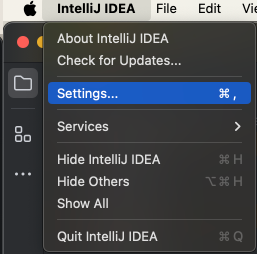

# Demo Lincheck project for ECOOP 2024
Testing Concurrent Algorithms with Lincheck and IntelliJ IDEA

### Setup
1. Install IntelliJ IDEA (Ultimate Edition)
2. Open `Plugins` screen 

 

3. Search for the `Lincheck` plugin and install it 

### Application
1. Open the example test [SPSCMSQueueTest](./src/test/kotlin/org/jetbrains/ecoop24/SPSCQueueTest.kt).
2. Run the test. 

3. Wait for the test to fail, scroll the output and find the button. 

4. Press the button and wait for the debugger to start. 

5. Enjoy the debugging!

### Tests and examples
Run with debugger these tests:
* [Single-consumer single-producer concurrent queue test](./src/test/kotlin/org/jetbrains/ecoop24/SPSCQueueTest.kt)
* [Fetch-And-Add Queue test](./src/test/kotlin/org/jetbrains/ecoop24/FaaQueueTest.kt)
* [Concurrent Deque from JDK test](./src/test/kotlin/org/jetbrains/ecoop24/ConcurrentDequeTest.kt)

