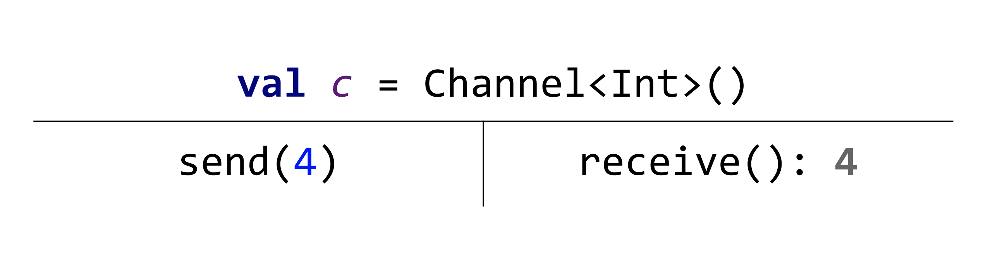
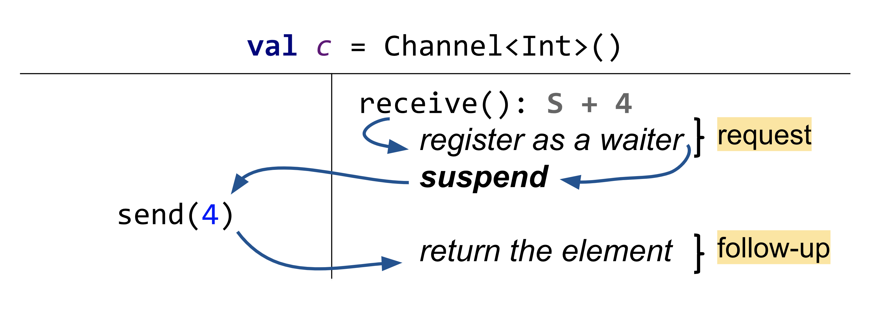

## Testing blocking data structures

`Lincheck` supports testing blocking data structures implemented via [suspending functions](https://github.com/Kotlin/KEEP/blob/master/proposals/coroutines.md#coroutines-overview)
from Kotlin language. The examples of such data structures from the Kotlin Coroutines library 
are mutexes, semaphores, and channels (see the [corresponding guide](https://kotlinlang.org/docs/reference/coroutines/coroutines-guide.html)
to understand what these data structures

### Dual data structures

Some data structures are blocking by design. Consider the synchronous queues 
(also known as channels in coroutines libraries), where senders and receivers perform a rendezvous handshake as a part of their protocol
(senders wait for receivers and vice versa). 

> See the [coroutines guide](https://kotlinlang.org/docs/reference/coroutines/coroutines-guide.html)
to learn more about these data structures.

The execution below is valid for a synchronous queue, but cannot be linearized by any sequential execution starting from either `send` or `receive` operation 
as it will suspend immediately.



To extend linearizability for blocking data structures we are using the dual data structures formalism described in the paper below.

> W.N. Scherer III and M.L. Scott. Nonblocking concurrent objects with condition synchronization. 
In Proceedings of the 18th International Symposium on Distributed Computing, pages 2121–2128, 2004.

According to the dual data structures formalism, we split every blocking operation into _request_ and _follow-up_ parts 
at the point of suspension. 
The request part either suspends the operation invocation and returns a unique ticket `s`, or completes immediately and returns the final result.

The follow-up part is executed when the operation is resumed, it takes the ticket `s` returned by the corresponding request as an argument. 

We need these tickets to determine which operation should be resumed when having several waiting senders or receivers.

This way, the synchronous queue execution above can be explained as following:

1. Register `receive()`-s request into the internal waiting queue of the channel;
2. `send(4)` peforms a rendezvous with the already registered `receive()` and passes `4` to it;
3. The `receive()` resumes and returns *4*.



>For more details on verification of dual data structures see this [talk at Hydra conference](https://nkoval.com/talks/#lincheck-hydra-2019)

### Test for a blocking data structure

To write a `Lincheck` test for a blocking data structure, you should not do anything special, 
just mark suspending testing functions with a `suspend` modifier, it will handle suspensions automatically.

Here is the test example for the basic communication primitive, a [rendezvous channel](https://kotlin.github.io/kotlinx.coroutines/kotlinx-coroutines-core/kotlinx.coroutines.channels/-channel/index.html):

```kotlin
@Param(name = "value", gen = IntGen::class, conf = "1:5")
class RendezvousChannelTest {
    private val ch = Channel<Int>()

    @Operation // suspending operation
    suspend fun send(@Param(name = "value") value: Int) = ch.send(value)

    @Operation // suspending operation
    suspend fun receive() = ch.receive()

    @Test
    fun stressTest() = StressOptions().check(this::class)
}
```

### State equivalency

Let's write a test for a [buffered channel](https://kotlin.github.io/kotlinx.coroutines/kotlinx-coroutines-core/kotlinx.coroutines.channels/-channel/index.html)
 defining the equivalency relation on the states of a channel; see the section on [verification tips](verification.md) for details.

For a buffered channel, the externally observable state may include: 
- elements from the buffer
- waiting `send` operations 
- whether the channel is closed

Here is the example of the buffered channel external state definition:

```kotlin
override fun extractState(): Any {
    val elements = mutableListOf<Int>()
    while (!ch.isEmpty) elements.add(ch.poll()!!)
    val closed = ch.isClosedForSend
    return elements to closed
}
```

Below is the complete example of a buffered channel test:

```kotlin
import kotlinx.coroutines.channels.*
import org.jetbrains.kotlinx.lincheck.*
import org.jetbrains.kotlinx.lincheck.annotations.*
import org.jetbrains.kotlinx.lincheck.check
import org.jetbrains.kotlinx.lincheck.paramgen.*
import org.jetbrains.kotlinx.lincheck.strategy.stress.StressOptions
import org.jetbrains.kotlinx.lincheck.verifier.VerifierState
import org.junit.Test

@Param(name = "value", gen = IntGen::class, conf = "1:5")
class BufferedChannelTest : VerifierState() {
    private val ch = Channel<Int>(3)

    @Operation(handleExceptionsAsResult = [ClosedSendChannelException::class])
    suspend fun send(@Param(name = "value") value: Int) = ch.send(value)

    @Operation(handleExceptionsAsResult = [ClosedReceiveChannelException::class])
    suspend fun receive() = ch.receive()

    @Operation
    fun close() = ch.close()

    override fun extractState(): Any {
        val elements = mutableListOf<Int>()
        while (!ch.isEmpty && !ch.isClosedForReceive) elements.add(ch.poll()!!)
        val closed = ch.isClosedForSend
        return elements to closed
    }

    @Test
    fun stressTest() = StressOptions().check(this::class)
}
```

## To sum up

In this section you've learnt how you can test blocking data structures implemented via suspending functions in Kotlin.

>Get the full code of the tests for the [rendezvous](../src/jvm/test/org/jetbrains/kotlinx/lincheck/test/guide/RendezvousChannelTest.kt) 
> and [buffered](../src/jvm/test/org/jetbrains/kotlinx/lincheck/test/guide/BufferedChannelTest.kt) channels.