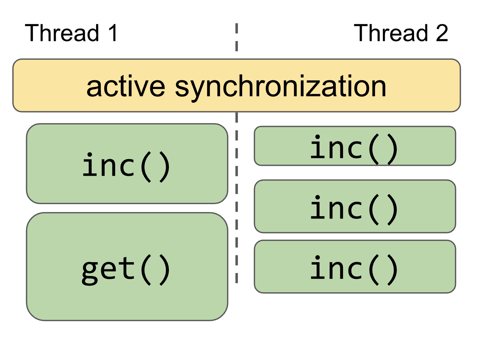

## Lincheck testing strategies

In this section we will take a closer look at the testing strategies provided by Lincheck. 

We are going to explain the structure of the test and what automatically happens under the hood for both stress and
model checking strategies via the example of the `Counter` from [the previous introductory section](introduction.md).
Below we provide the `Counter` implementation once again:

```kotlin
class Counter {
    @Volatile
    private var value = 0

    fun inc(): Int = ++value
    fun get() = value
}
```

## Stress testing

### Steps to write a stress test

Let's dissect the structure of the stress test for our `Counter`, here are the steps:

1. Create an instance of the `Counter` as an initial state.
2. List operations defined on the `Counter` and mark them with `@Operation` annotation.
3. Specify the stress testing strategy via the corresponding `StressOptions()` class.
4. Run the analysis by invoking the `StressOptions().check(..)` on the testing class.

Below is the full code of the test:

```kotlin
import org.jetbrains.kotlinx.lincheck.annotations.Operation
import org.jetbrains.kotlinx.lincheck.check
import org.jetbrains.kotlinx.lincheck.strategy.stress.StressOptions
import org.jetbrains.kotlinx.lincheck.verifier.VerifierState
import org.junit.Test

class CounterTest {
   private val c = Counter() // initial state

   // operations on the Counter
   @Operation fun inc() = c.inc()
   @Operation fun get() = c.get()

   @Test // run the test
   fun stressTest() = StressOptions().check(this::class)
}
```

### How stress strategy works under the hood

At first, some parallel execution scenario is generated from the operations that were marked with `@Operation` annotation.

Then `Lincheck` starts real threads, synchronizes them in an active manner to guarantee that the operations are performed in parallel, 
and executes the operations, repeating the run many times in the hope to hit an interleaving that produces an incorrect result.

Below is the high-level picture of how one of the stress executions for the `Counter` may be performed.



## Model checking

When you find the incorrect execution of your algorithm using the stress testing strategy, you can still
spend hours trying to figure out how this incorrect execution could happen. This process is automated with 
the model checking strategy.

### Steps to write a model checking test

A model checking test is constructed the same way as the stress test &ndash; you just need to replace the `StressOptions()` 
that specify the testing strategy with `ModelCheckingOptions()`. 

Find below the `modelCheckingTest()` function, that will run the test using the model checking strategy:

```kotlin
@Test 
fun modelCheckingTest() = ModelCheckingOptions().check(this::class)
```

> **Java 9+ support**
>
> Please note that to use model checking strategy for Java 9+ you should add the following JVM property.
They are required if the testing code uses classes from `java.util` package since
some of them use `jdk.internal.misc.Unsafe` or similar internal classes under the hood:
> ```text
> --add-opens java.base/jdk.internal.misc=ALL-UNNAMED
> --add-exports java.base/jdk.internal.util=ALL-UNNAMED
> ```

### How model checking works under the hood

We provide model checking strategy for the algorithms under _the sequential consistency memory model_.
In the model checking strategy `Lincheck` examines many different interleavings within a bounded number of context switches.

Interesting switch point locations in the code include: shared memory accesses, such as field and array element reads or updates in JVM,
synchronization primitives like lock acquisition and release, `park` / `unpark` (stops and resumes the specified thread, respectively), 
`wait`/`notify` and some others.

Model checking strategy controls the execution, therefore Lincheck can provide the trace that leads to the invalid interleaving 
and that is extremely helpful in practice. 

You have seen the example of trace for the incorrect execution of the counter in the [introductory section](introduction.md#Trace-the-invalid-execution).

## Which testing strategy to use?

The _model checking strategy_ is preferable for finding bugs under the sequentially consistent memory model,
since it ensures better coverage and provides a failing execution trace if an error is found.

Although _stress testing_ does not guarantee any coverage, we still find it very useful to check algorithms for
bugs introduced by low-level effects, such as a missed `volatile` modifier.
Stress testing is also a great help in discovering very rare bugs that require many context switches to reprodude, 
and it's not possible to analyse all of them due to the current resrtictions in the model checking strategy.

## Configurations

We can configure the testing strategy via setting options in the `<TestingMode>Options` class.

Let's set the options for scenario generation and execution for our `CounterTest`:

```kotlin
import org.jetbrains.kotlinx.lincheck.annotations.Operation
import org.jetbrains.kotlinx.lincheck.check
import org.jetbrains.kotlinx.lincheck.strategy.stress.StressOptions
import org.jetbrains.kotlinx.lincheck.verifier.VerifierState
import org.junit.Test

class CounterTest {
    private val c = Counter() 
    
    @Operation fun inc() = c.inc()
    @Operation fun get() = c.get()

   @Test
   fun stressTest() = StressOptions() // stress testing options
      .actorsBefore(2) // Init part
      .threads(2).actorsPerThread(2) // Parallel part
      .actorsAfter(1) // Post part
      .minimizeFailedScenario(false) // Turn off minimization of the invalid scenario
      .invocationsPerIteration(1000) // Run each scenario 1000 times
      .check(this::class)
}
```

If we run `stressTest()` again, the output will look like this:

```text 
= Invalid execution results =
Init part:
[inc(): 1, inc(): 2]
Parallel part:
| get(): 2 | inc(): 3       |
| inc(): 3 | get(): 3 [2,1] |
Post part:
[inc(): 4]
---
values in "[..]" brackets indicate the number of completed operations 
in each of the parallel threads seen at the beginning of the current operation
---
```

Note, that we turned off the `minimizeFailedScenario` option to see the test failure on the scenario that was originally 
generated according the options that we have set.

However, most of the bugs can be reproduced with fewer operations than in the originally generated scenario and 
it is obviously a lot easier to debug the minimal invalid scenario. So, `minimizeFailedScenario` option is enabled by default.

The minimized invalid execution for our example is:

```text
= Invalid execution results =
Parallel part:
| inc(): 1 | inc(): 1 |
```

## Logging data structure states

Another feature useful for debug is state logging. For this, we should define a method returning a `String` representation 
of a data structure marked with `@StateRepresentation` in the test class. 

> This method should be thread-safe, non-blocking, and should not modify the data structure. 

The `String` representation of the `Counter` is just it's value. Add the following code to the `CounterTest`:

```kotlin
@StateRepresentation
fun counterReperesentation() = c.get().toString()
```

For stress testing the state representation is requested after the init and post execution parts as well as after the parallel part.

For model checking the state representation may be printed after each read or write event.

Run the `modelCheckingTest()` now, and check the state of the Counter printed at the switch points (`STATE:<value>`):

```text
= Invalid execution results =
STATE: 0
Parallel part:
| inc(): 1 | inc(): 1 |
STATE: 1
= The following interleaving leads to the error =
Parallel part trace:
|                      | inc()                                                |
|                      |   inc(): 1 at CounterTest.inc(CounterTest.kt:42)     |
|                      |     value.READ: 0 at Counter.inc(CounterTest.kt:35)  |
|                      |     switch                                           |
| inc(): 1             |                                                      |
| STATE: 1             |                                                      |
|   thread is finished |                                                      |
|                      |     value.WRITE(1) at Counter.inc(CounterTest.kt:35) |
|                      |     STATE: 1                                         |
|                      |     value.READ: 1 at Counter.inc(CounterTest.kt:35)  |
|                      |   result: 1                                          |
|                      |   thread is finished                                 |
```

## To sum up

In this section you have got the high-level overview of stress and model checking strategies, 
now you know how they differ and which testing strategy is preferable for different use-cases.

>Get the full code of examples from the section [here](../src/jvm/test/org/jetbrains/kotlinx/lincheck/test/guide/CounterTest.kt)
>
>Get more test examples [here](../src/jvm/test/org/jetbrains/kotlinx/lincheck/test/guide/StackTest.kt)

In [the next section](parameter-generation.md) you will learn how to configure arguments passed to the test operations
and when it may be useful.