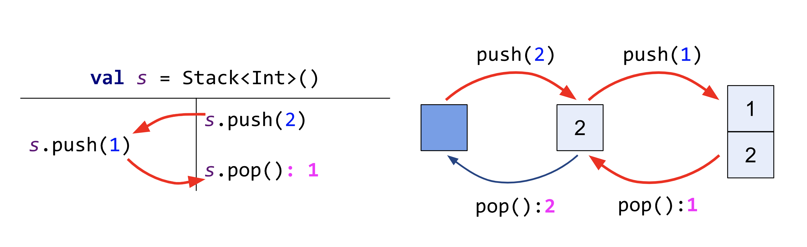

## Verification

Once the scenario is executed, the outcome should be verified relative to the specified correctness contract.
By default `Lincheck` checks the results for _linearizability_, the standard correctness property for thread-safety.

In order to check whether the results satisfy linearizability, `Lincheck` tries to explain them with some sequential execution 
which does not reorder operations in threads and does not violate the happens-before order constructed during the execution.

We define the sequential semantics via building a transition graph: 
the states represent the data structure states and the transitions are labeled with operations and the 
corresponding results. A sequence of operations application is valid according to the sequential semantics 
iff there exists a finite path of the transitions labeled by these operations in this graph.

As an example, let's check whether the results of one of the possible executions of the stack are linearizable.
On the left of the scheme you can see the results of the execution and on the right 
there is the transition graph built by `Lincheck` to explain those results. Here are the steps of verification:  
**T2:** Apply `push(2)` from the 2nd thread to the empty stack (the initial state).   
**T2:** Try to complete the 2nd thread, but the following `pop()` invocation returns the previously pushed `2` instead of `1` from the results.   
**T1:** Switch to the 1st thread and apply `push(1)`.  
**T2:** Switch back to the 2nd thread and execute `pop()` which now returns `1` as expected.  



This way, `Lincheck` successfully found a sequential history that produces the given results, showing that they are correct.
At the same time, if none of the explored sequential histories explains the given result `Lincheck` reports an error.

### Sequential specification

During verification we sequentially apply operations of the tested algorithm by default.

To be sure that the algorithm provides correct sequential behaviour, you can define it's _sequential specification_ 
via writing a simple sequential implementation of the algorithm.

> This also allows to write a single test instead of writing sequential and concurrent tests separately. 

To provide a sequential specification of the algorithm for verification:
1. Implement sequential version of all the testing methods. 
2. Pass the class with sequential implementation to the `sequentialSpecification` option:
   `StressOptions().sequentialSpecification(SequentialStack::class)`.

As an example, let's provide sequential specification for the stack:

```kotlin
import org.jetbrains.kotlinx.lincheck.annotations.*
import org.jetbrains.kotlinx.lincheck.check
import org.jetbrains.kotlinx.lincheck.strategy.stress.StressOptions
import org.junit.Test

class StackTest {
    private val s = Stack<Int>()

    @Operation fun push(value: Int) = s.push(value)
    @Operation fun pop() = s.pop()
    @Operation fun size() = s.size
    
    // sequential implementation
    class SequentialStack {
      val s = LinkedList<Int>()

      fun push(x: Int) = s.push(x)
      fun pop() = s.pop()
      fun size() = s.size
    }

    @Test
    fun stressTest() = StressOptions()
        .sequentialSpecification(SequentialStack::class.java)
        .check(this::class)
}
```

### States equivalency

You may have noticed the following warning preceding the output of every test:
```
To make verification faster, you can specify the state equivalence relation on your sequential specification. ….
```
Now we will explain what exactly is suggested to be done to make verification faster.

`Lincheck` builds transition graph, invoking operations of the provided sequential implementation and several transition sequences may lead to the same state.
For example, applying `pop()` after the first `push(2)` leads back to the initial state. 

So if you define the equivalency relation between the states of a data structure, via implementing `equals()` and `hashCode()` methods on the test class,
the number of states in the transition graph will decease that will speed up verification.
 
`Lincheck` provides the following way to do that:
1. Make the test class extend `VerifierState`.
2. Override `extractState()` function: it should define the state of a data structure

> Note that `extractState()` is called once and can modify the data structure.

Let's define `extractState()` for the stack:
  
```kotlin
class StackTest : VerifierState() {
  private val s = Stack<Int>()
  ...
  override fun extractState(): List<Int> {
    val elements = mutableListOf<Int>()
    while(s.size != 0) { 
      elements.add(s.pop())
    }
    return elements
  }
}
```

### Handling exception as a result

Your implementation may throw an exception according to the contract. 
You can define potentially thrown exceptions as legal results via listing them in the `handleExceptionsAsResult` option 
of the `@Operation` annotation over the corresponsing operation.

For example `pop()` operation on the stack may throw `NoSuchElementException`. 
Define this exception as a legal result of `pop()` invocation the following way:

```kotlin
@Operation(handleExceptionsAsResult = [NoSuchElementException::class])
fun pop() = s.pop()
```

### Validation of invariants

It is also possible to add the validation of the data structure invariants, implemented via functions that can be executed 
multiple times during execution when there is no running operation in an intermediate state 
(e.g., in the stress mode they are invoked in the beginning and at the end of the parallel execution). 

Validation functions are marked with a special `@Validate` annotation, have no argument, and do not return anything. 
In case the testing data structure is in an invalid state, they should throw an exception.

Consider for example the part of the test for a linked list, which supports concurrent removals. 
A typical invariant is that “removed nodes should not be reachable when all the operations are completed”. 
The validation function `checkNoRemovedNodes` checks this invariant, throwing an exception if it is violated.

```kotlin
class MyLockFreeListTest {
  private val list = MyLockFreeList<Int>()  

  @Validate 
  fun checkNoRemovedNodesInTheList() = check(!list.hasRemovedNodes()) {
    "The list contains logically removed nodes while all the operations are completed: $list"
  }
  
  ...
}
```

## To sum up

In this section you've got a high level idea of how `Lincheck` checks execution results for correctness,
how to check sequential behaviour of the algorithm and make verification faster.

>Get the full code of the examples [here](../src/jvm/test/org/jetbrains/kotlinx/lincheck/test/guide/StackTest.kt).
  
[The next section](blocking-data-structures.md) covers a more advanced topic of testing blocking data structures.